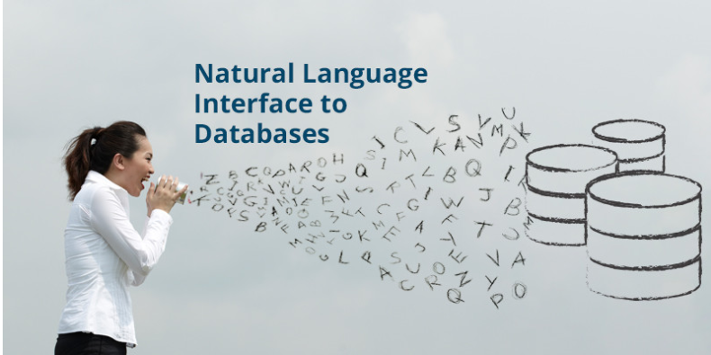
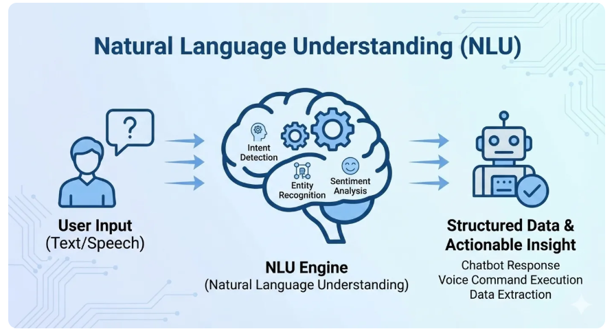

---

# 🚀 Natural-Language-Interfaces-for-Databases-Hack-N-Go-with-MongoDB

---

# 🤖 Natural Language to MongoDB Query Converter

A **Streamlit-based web application** that converts **natural language queries into MongoDB queries** using **LangChain, OpenAI GPT, and MongoDB**.

This system allows users to interact with databases using **plain English instead of writing complex MongoDB commands**, making database access easier for **non-technical users**.
# NATURAL LANGUAGE INTERFACE

<p align="center">
  
</p>
<p align="center">
  
</p>
---

# 🎥 Project Demo

Add your demo video or presentation link here.


Example:

```
📊 Canva Presentation:
https://www.canva.com/

🎬 Project Demo Video:
https://drive.google.com/file/d/1zMcrTQ8UZZc0bLA4SvkXdhb0PRzGJWig/view?usp=drive_link
```

---

# ✨ Features

### 🧠 Natural Language Query Processing

Users can enter queries in plain English, and the system converts them into optimized MongoDB queries automatically.

---

### 🔗 LangChain Integration

The project uses **LangGraph Agent workflow** to process queries in multiple steps and generate accurate database commands.

---

### 🖥️ Interactive User Interface

The application uses **Streamlit** to provide a clean and simple interface for entering queries and viewing results.

---

### 📊 MongoDB Query Execution

The generated queries are executed directly on MongoDB and the results are displayed instantly.

---

### 🐳 Docker Deployment

The project is containerized using **Docker** for easy deployment and portability.

---

# 🏗️ System Architecture

The project consists of the following components:

---

## 🎨 Frontend

### **Streamlit Application**

* Accepts natural language queries from users
* Displays generated MongoDB queries
* Shows query results

---

## ⚙️ Backend

### 🤖 LangChain + OpenAI GPT

* Converts natural language queries into MongoDB commands
* Uses LangGraph agent workflow for intelligent query generation

### 🗄️ Database Handler

* Connects to MongoDB
* Executes generated queries
* Returns results to the application

---

## 🗃️ Database

### **MongoDB**

* Stores the dataset
* Supports powerful **NoSQL queries**

---

## 🚀 Deployment

### **Docker Container**

* Ensures consistent runtime environment
* Simplifies application deployment
   (images/architecture.png)
---
# 📊 Architecture Diagram

<p align="center">
  
</p>
<p align="center">
  
</p>
---

# 🔄 LangGraph Agent Workflow

The LangGraph agent processes the request in multiple steps:

1️⃣ Receive natural language query
2️⃣ Analyze the query intent
3️⃣ Convert the query to MongoDB syntax
4️⃣ Execute query in MongoDB
5️⃣ Return results to the user

# THE AGENTS WORK FLOW
<p align="center">
  
</p>
---

# ⚡ Installation and Setup

## 📋 Prerequisites

Make sure the following are installed:

* 🐍 Python 3.10 or above
* 🐳 Docker
* 🍃 MongoDB
* 🔑 OpenAI API Key

---

# 📥 Clone the Repository

```bash
(https://github.com/jsaiteja4074/Natural-Language-Interfaces-for-Databases-Hack-N-Go-with-MongoDB/tree/main)
cd NL2MongoDB
```

---

# 🔐 Configure Environment Variables

Create a `.env` file in the project root directory.

Example:

```
OPENAI_API_KEY=your_api_key

MONGO_URI=mongodb://localhost:27017

DATABASE_NAME=studentdb

COLLECTION_NAME=students

PROMPT_PATH=prompts/query_prompt.txt

AGENT_PROMPT_PATH=prompts/agent_prompt.txt

LOG_FILE=logs/app.log
```

---

# ▶️ Run the Application

## 🐳 Using Docker

Build the Docker image

```bash
docker build -t nl2mongodb .
```

Run the container

```bash
docker run -p 8080:8080 nl2mongodb
```

Open your browser and visit:

```
http://localhost:8080
```

---

## 💻 Running Locally (Without Docker)

Install dependencies

```bash
pip install -r requirements.txt
```

Run the Streamlit application

```bash
streamlit run app.py
```

---

# 🧑‍💻 How to Use

1️⃣ Open the Streamlit web interface.
2️⃣ Enter a natural language query.

Example queries:

```
Show all students
```

```
Find students with marks greater than 80
```

```
Show students from CSE department
```

3️⃣ The system will:

* Convert the input to a MongoDB query
* Execute the query
* Display the results instantly

---

# 🛠️ Technologies Used

| Technology       | Purpose                     |
| ---------------- | --------------------------- |
| 🐍 Python        | Backend development         |
| 🎨 Streamlit     | Web interface               |
| 🤖 OpenAI GPT-4o | Natural language processing |
| 🔗 LangChain     | LLM workflow and agents     |
| 🍃 MongoDB       | Database                    |
| 🐳 Docker        | Containerized deployment    |

---

# 🔍 Example Workflow

### 👤 User Input

```
Show students with marks greater than 80
```

### ⚙️ Generated MongoDB Query

```
db.students.find({ "marks": { "$gt": 80 } })
```

### 📊 Output

```
List of students matching the condition
```

---

# 📁 Project Structure

```
NL2MongoDB
│
├── app.py
├── main.py
├── requirements.txt
├── Dockerfile
├── .env
│
├── utils
│   ├── llm_handler.py
│   ├── db_handler.py
│
├── prompts
│   ├── query_prompt.txt
│   └── agent_prompt.txt
│
└── README.md
```

---

# 📸 Demo

Add screenshots or demo images here.

Example sections:

### 🏠 Home Page
<p align="center">
  
</p>

### 💬 Query Input
<p align="center">
  
</p>
### ⚙️ Generated MongoDB Query

### 📊 Output Results
         <p align="center">
  
</p>
---

# 🔮 Future Improvements

* 🌐 Support for multiple databases (SQL, PostgreSQL)
* 🎤 Voice-based database querying
* 🧠 Advanced query handling
* ☁️ Cloud deployment
* 📈 Support for larger datasets

---

# 🤝 Contributing

Contributions are welcome.

Steps to contribute:

1️⃣ Fork the repository
2️⃣ Create a new branch

```
git checkout -b feature-branch
```

3️⃣ Commit changes

```
git commit -m "Added new feature"
```

4️⃣ Push to GitHub

```
git push origin feature-branch
```

5️⃣ Open a Pull Request

---

# 📜 License

This project is licensed under the **MIT License**.

---
